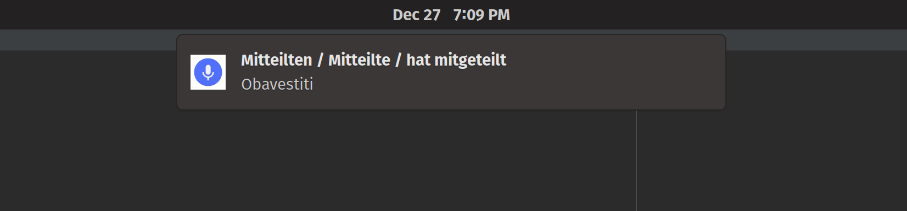

# desktop-notifier

Intended for periodical display of desktop notifications with user defined content



Show system notifications on a scheduled basis

Notifications can contain anything user would like displayed. There is one configuration file which contains the
frequency of the notifications to be displayed, as well as the list of things that will get displayed

Uses [`jcgay/send-notifications`](https://github.com/jcgay/send-notification/wiki) for the notification management

## Supported commands

:information_source: We can build two executable types: `java` and `native` one

### Build java executable

```shell
$ make build-jar
```

### Execute java executable

```shell
$ make desktop-notifier ARGS="-c /full/path/to/file/containing/items/to/display"
```

#### Parameters

* `[REQUIRED]` `--content-file` or `-c`

  An absolute path to the content file containing items to be shown as notifications
  
  Each line in the file becomes one desktop notification. An example file content:

  ```
  Guten Abend=Good evening
  Wie geht's=How's it going
  ```

* `[OPTIONAL]` `--change-frequency` or `-f`

  Duration in seconds between the two notifications

### Build native executable (requires GraalVM configured)

Read [here](https://quarkus.io/guides/building-native-image#configuring-graalvm) how to install & configure GraalVM

After installing and configuring, run the following:

```shell
$ make build-native-exec
```

This will generate `desktop-notifier` file in the project root, which can be run via:

```shell
$ ./desktop-notifier -c /full/path/to/file/containing/items/to/display
```